# EP0404 AWS Cloud Foundation Lab 3 Assessment Part 1

# Individual Component (15%)

Topic: Build a Serverless Web Application

[https://aws.amazon.com/getting-started/hands-on/build-serverless-web-app-lambda-apigateway-s3-dynamodb-cognito/](https://aws.amazon.com/getting-started/hands-on/build-serverless-web-app-lambda-apigateway-s3-dynamodb-cognito/)

By: _Benjamin Cheong Chee Weng

# Content

1. Introduction
  1. _Why I choose the hands-on lab?_
  2. _How this hands-on lab has helped me?_
  3. _Where can I apply the knowledge from this hands-on lab?_
2. Host a Static Website
  1. _Select a Region_
  2. _Create a Git repository_
  3. _Populate the Git repository_
  4. _Enable Web Hosting with the AWS Amplify Console_
  5. _Modify your site_
3. Manage Users
  1. _Create an Amazon Cognito User Pool_
  2. _Add an App to your user Pool_
  3. _Update the Website Config_
  4. _Testing Implementation_
4. Build a serverless Backend
  1. _Create an Amazon DynamoDB Table_
  2. _Create an IAM Role for your Lambda function_
  3. _Create a Lambda Function for Handling Requests_
  4. _Testing Implementation_
5. Deploy a RESTful API
  1. _Create a New REST API_
  2. _Create a Cognito User Pools Authorizer_
  3. _Create a new resource and method_
  4. _Deploy your API_
  5. _Update the Website Config_
  6. _Validating Implementation_

# **Introduction**

Why I choose the hands-on lab?

Ans: I chose this hands-on lab as I have an interested in Full-Stack Development and is in-line with my current module that I&#39;m studying as a 2nd-year DIT student. This lab also deals with multiple amazon web service&#39;s and a robust amazon web service architecture. Therefore, it helps me deepen my understanding from this module and the lab that is completed.

How this hands-on lab has helped me?

Ans: This hands-on lab allows me to build a serverless web application on Amazon. This allowed me to link what I have learnt previously and apply it on amazon web services. Furthermore, this allows me to understand the different services use cases, features, application. This has also allowed me to understand how the services are implemented together into one big architecture. I have learnt how to use AWS CLI, AWS DyanmoDB, AWS CLI, AWS Cloud9, AWS EC2, AWS CodeCommit, AWS API Gateway, AWS Lambda, AWS Cognito and AWS S3. As this is a hands-on lab, I put my knowledge to the test and apply all that I have learnt and done to build my serverless web application.

Where can I apply the knowledge from this hands-on lab?

Ans: I&#39;m able to apply my knowledge in my modules, at my intern job, personal projects and any projects that are a robust and scalable web development project.

# Section 2: Host a Static Website

Step 1: Select A Region at the top right corner of the AWS Management Console

Step 2: Create IDE Environment with AWS Cloud 9

1. Open AWS Cloud 9
2. Create Environment and Name: 1922491-BenjaminCheong

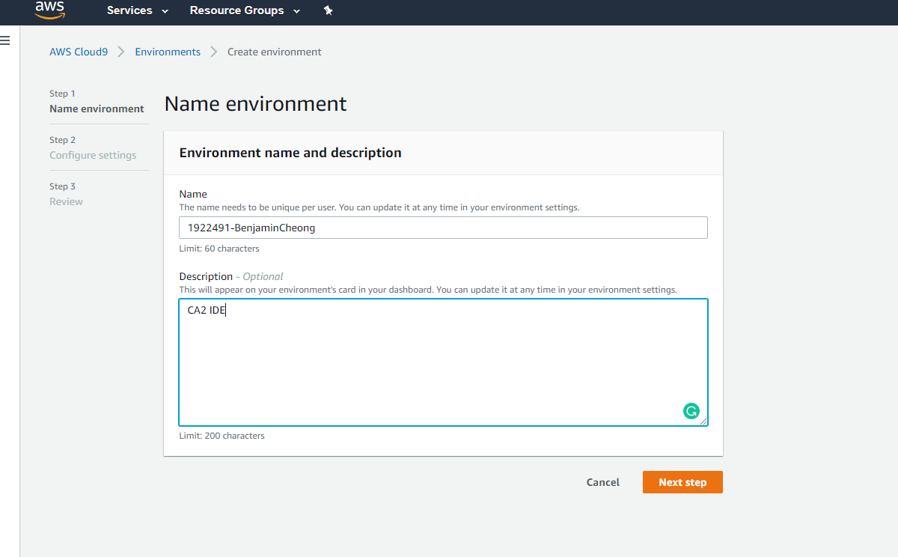_Figure 1(A)_

Step 3: Create a Git Repository

1. Open the AWS Code Commit Console
2. Select Create Repository

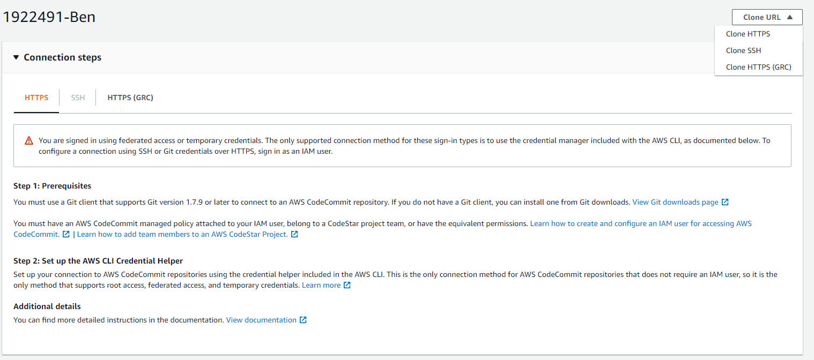

_Figure 1(B)_

1. Set the Repository name to your admin number
2. Select Create 

_Figure 1(C)_

1. Set up an IAM user with Git Credentials in the IAM Console.
2. Back in the Code Commit Console, From the URL Dropdown, Select Clone HTTPS
3. From the Terminal Window run git clone and the HTTPS URL of the repository.

$ git clone https://git-codecommit.Singapore.amazonaws.com/v1/repos/1922491-BenjaminCheong
Cloning into &#39;1922491-BenjaminCheong&#39;...

Step 4: Populate the Git Repository

1. Change the directory into your repository and copy the static file from S3
2. _cd 1922491-BenjaminCheong/_
_git clone https://git-codecommit.us-east-1-amazonaws.com/v1/repos/1922491-Ben_
3. Commit the files to your Git service

_$ git add .
 $ git push_

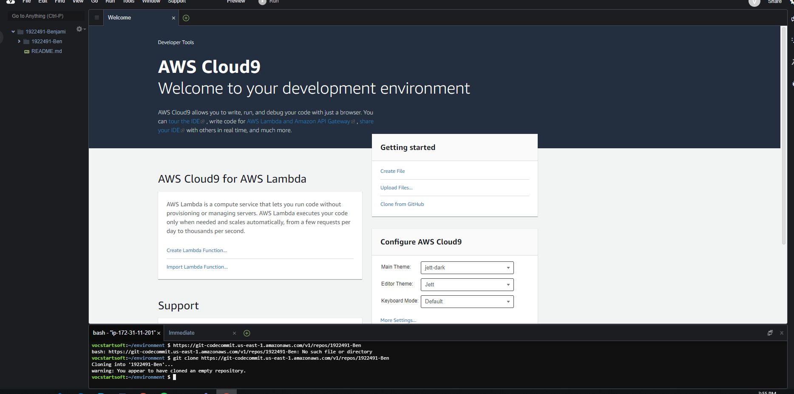

_Figure 1(D)_

Step 5: Enable Web Hosting with the AWS Amplify Console

1. Launch the [Amplify Console console page](https://console.aws.amazon.com/amplify/home)
2. Click **Get Started** under Deploy with Amplify Console

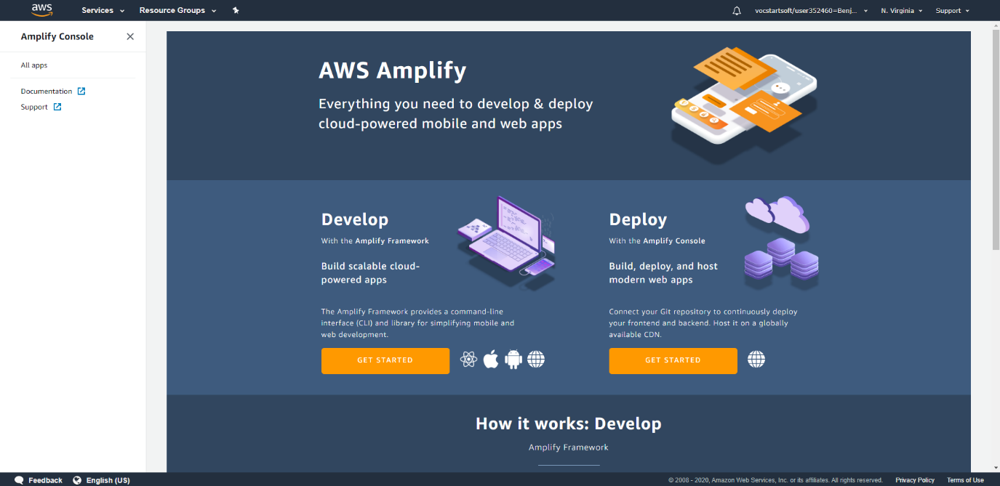

_Figure 1(E)_

1. Select the Repository service provider used today and select **Next**
2. Authorize AWS Amplify to your GitHub account
3. From the dropdown select the _Repository_ and _Branch_ created
4. On the &quot;Configure build settings&quot; page leave all the defaults and select **Next**
5. On the &quot;Review&quot; page select **Save and deploy**
6. The process takes a couple of minutes for Amplify Console to create the necessary resources and to deploy your code. Once Completed, click on the site image to launch your 1922491-BenjaminCheong site.

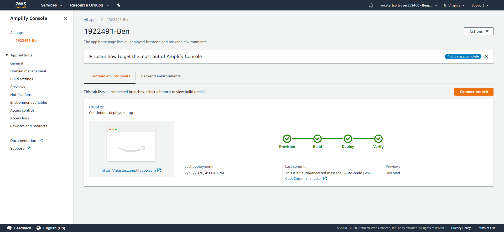

_Figure 1(F)_

Step 6: Modify your site

1. Open the ` index.html` page and modify the title line so that it says: \&lt;title\&gt; 1922491-BenjaminCheong Website!! \&lt;/title\&gt;
2. Save the file and commit to your git repository again. Amplify Console will begin to build the site again soon after it notices the update to the repository.

_Figure 1(G)_

1. Head back to [Amplify Console console page](https://console.aws.amazon.com/amplify/home)

$ git add index.html

$ git commit -m &quot;updated title&quot;

1. Once completed, re-open the site that you just created and notice the title change.

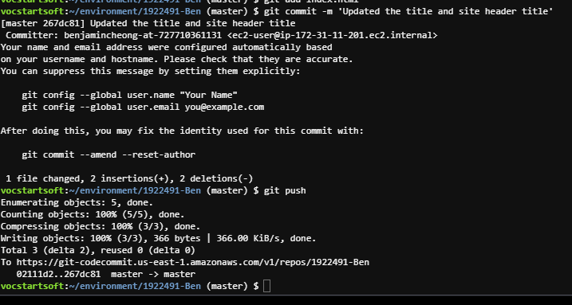

_Figure 1(H)_

# Section 3: Manage Users

Step 1: Create an Amazon Cognito User Pool

1. From the AWS Console Click **Services** then select **Cognito** under Mobile Services.

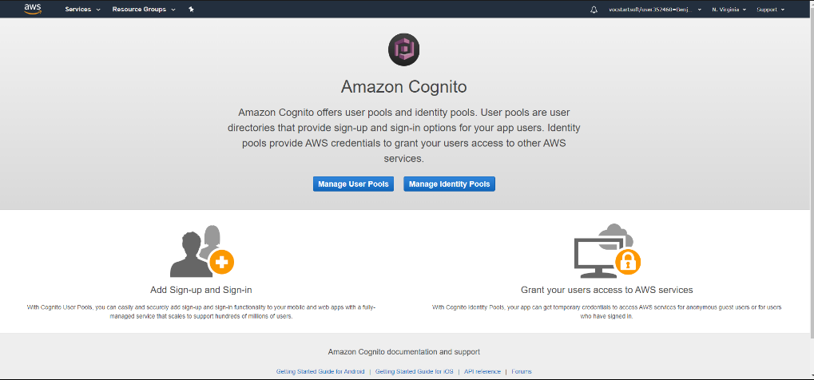

_Figure 2(A)_

1. Choose **Manage your User Pools**.
2. Choose **Create a user Pool.**
3. Provide a name for your user pool such as BenGroup, then select **Review Defaults**

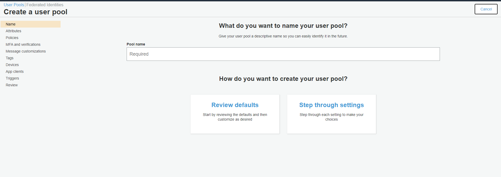

_Figure 2(B)_

1. On the review page, click **Create pool.**

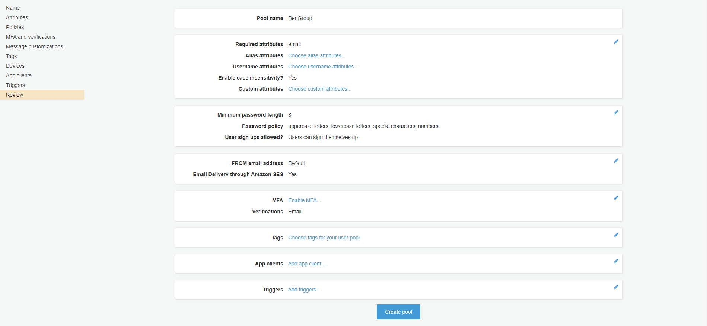

_Figure 2(C)_

1. Note the **Pool Id** on the Pool details page of your newly created user pool.

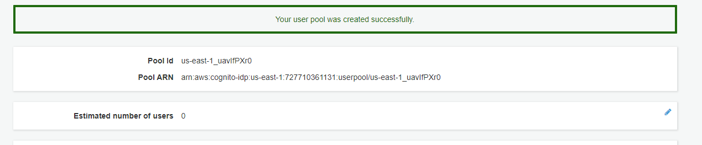

_Figure 2(D)_

Step 2: Add an App to your User Pool

1. From the Pool Details page for your user pool, select **App clients** from the left **General Settings** section in the navigation bar.
2. Choose **Add an app client.**
3. Give the app client a name such as BenCheongWebApp.
4. **Uncheck** the Generate client secret option. Client secrets aren&#39;t currently supported for use with browser-based applications.
5. Choose **Create app client.**

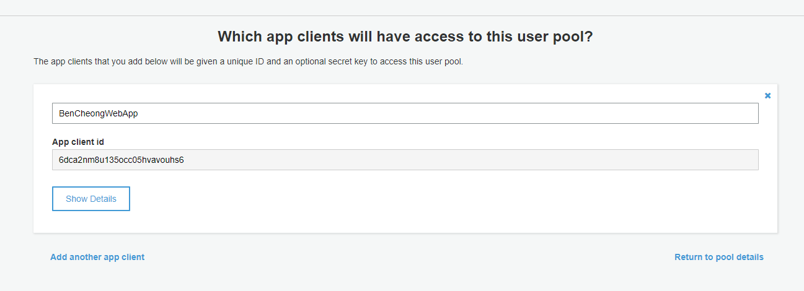

_Figure 2(E)_

1. Note the **App client id** for the newly created application.

_Figure 2(F)_

Step 3: Update the Website Config

1. From the local machine, open `1922491-Ben/js/config.js` in Visual Studio Code.
2. Update the Cognito section with the correct values for the user pool and app you just created. Should look like this below.

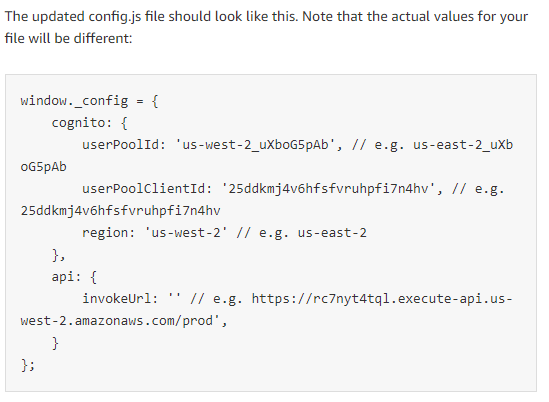

_Figure 2(G)_

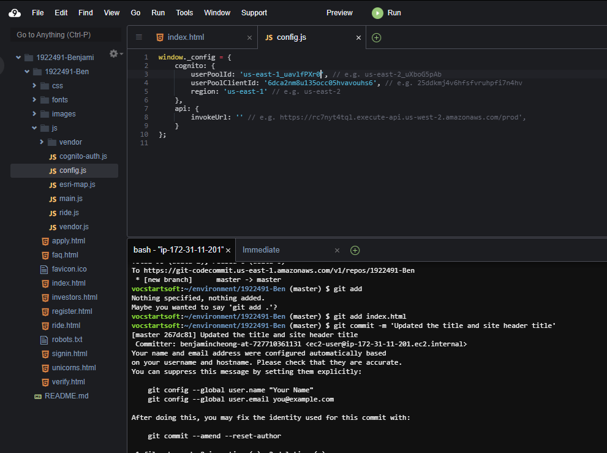

_Figure 2(H)_

1. Save the modified file and push it to your Git repository to have it automatically deployed to Amplify Console.

$ git push

Step 4: Test your Implementation

1. Visit /register.html under your website domain
2. Complete the registration form and choose **Let&#39;s Ryde**. You should see and alert that confirms that your user has been created.
3. Confirm your new user using one of the two following methods.
4. Complete the account verification process by visiting under your website domain and entering verification code that is emailed to you.
5. From the AWS console, click Services then select **Cognito** under Security, Identity &amp; Compliance.
6. Choose **Manage your User Pools**
7. Select the 1922491-BenjaminCheong user pool and click Users and groups in the left navigation bar.
8. Choose **Confirm** user to finalize the account creation process.
9. After confirming the new user using either the /verify.html page or the Cognito console, visit /signin.html and log in using the email address and password you entered during the registration step.
10. If successful you should be redirected to /ride.html. You should see a notification that the API is not configured.

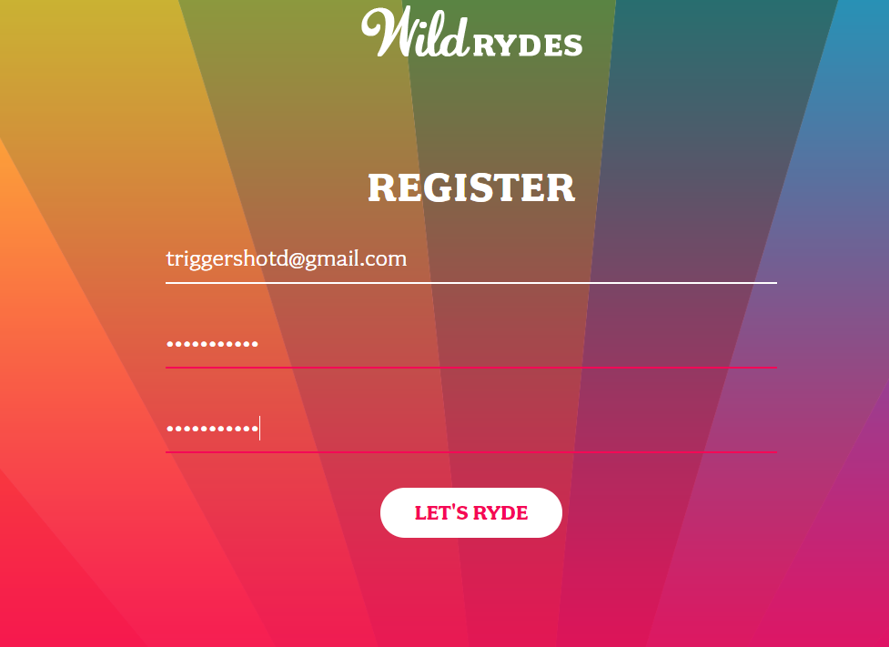

_Figure 2(I)_

# Section 4: Serverless Service Backend

Step 1: Create an Amazon DynamoDB Table

1. From the AWS Management Console, choose **Services** then select **DynamoDB** under Databases.

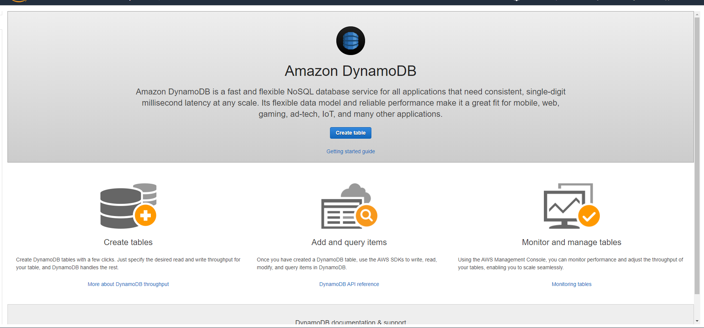

_Figure 3(A)_

1. Choose **Create table**.
2. Enter Rides for the **Table name**. This field is case sensitive.
3. Enter RideId for the **Partition key** and select **String** for the key type. This field is case sensitive. 

_Figure 3(B)_

1. Check the **Use default settings** box and choose **Create**.
2. Scroll to the bottom of the Overview section of your new table and note the **ARN**. You will use this in the next section.

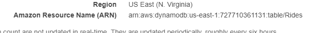

_Figure 3(C)_

Step 2: Create an IAM Role for your Lambda function

1. From the AWS Management Console, click on **Services** and then select **IAM** in the Security, Identity &amp; Compliance section.
2. Select **Roles** in the left navigation bar and then choose **Create New Role**.

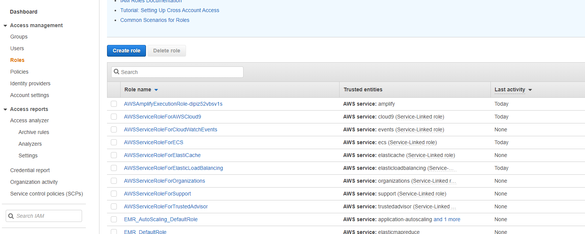

_Figure 3(D)_

1. Select **Lambda** for the role type from the **AWS service** group, then click **Next: Permissions**.

**Note:** Selecting a role type automatically creates a trust policy for your role that allows AWS services to assume this role on your behalf. If you were creating this role using the CLI, AWS CloudFormation or another mechanism, you would specify a trust policy directly.

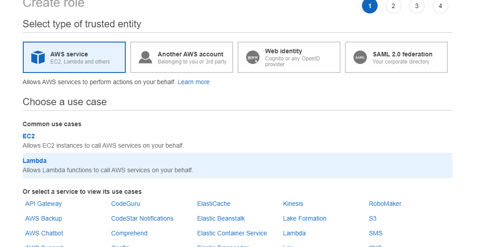

_Figure 3(E)_

1. Begin typing AWSLambdaBasicExecutionRole in the **Filter** text box and check the box next to that role.
2. Choose **Next Step**.

_Figure 3(F)_

1. Enter 1922491-BenjaminCheong for the **Role Name**.
2. Choose **Create Role.**
3. Type 1922491-BenjaminCheongLambda into the filter box on the Roles page and choose the role you just created.

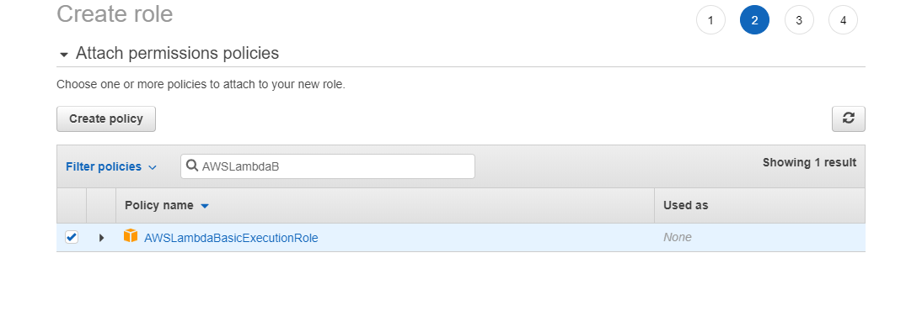

_Figure 3(G)_

1. On the Permissions tab, choose the **Add inline policy** link in the lower right corner to create a new inline policy.

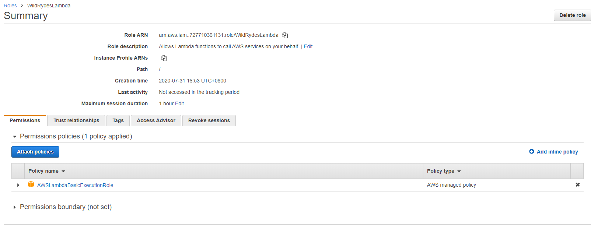

_Figure 3(H)_

1. Select **Choose a service.**

2. Begin typing DynamoDB into the search box labelled **Find a service** and select **DynamoDB** when it appears.
3. Choose **Select actions**.

4. Begin typing PutItem into the search box labelled Filter actions and check the box next to **PutItem** when it appears.

5. Select the **Resources** section.
6. With the **Specific** option selected, choose the Add ARN link in the **table** section.

7. Paste the ARN of the table you created in the previous section in the **Specify ARN for table field** and choose **Add.**
8. Choose Review Policy.

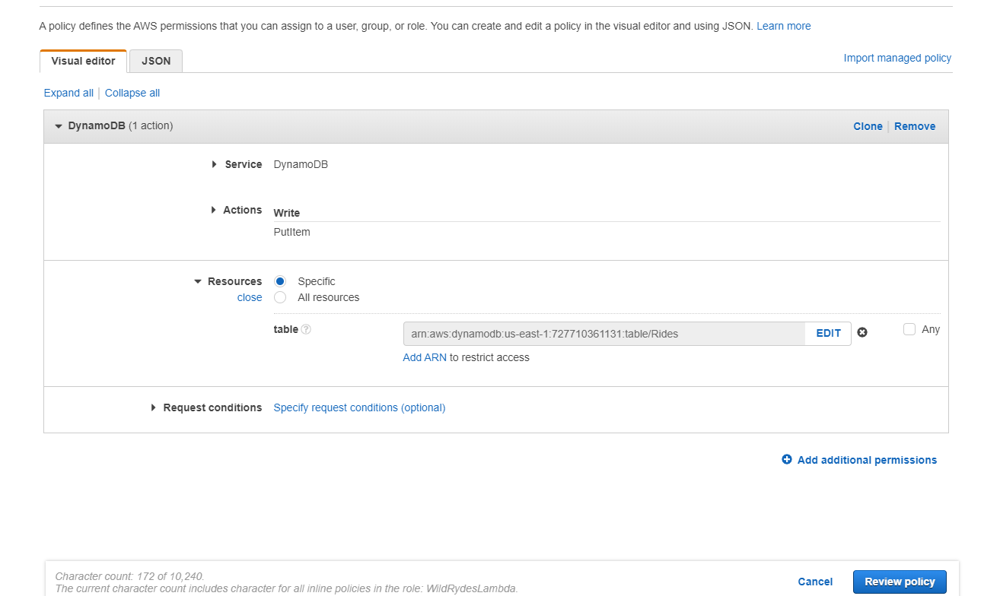

_Figure 3(I)_

1. Enter DynamoDBWriteAccess for the policy name and choose **Create policy.**

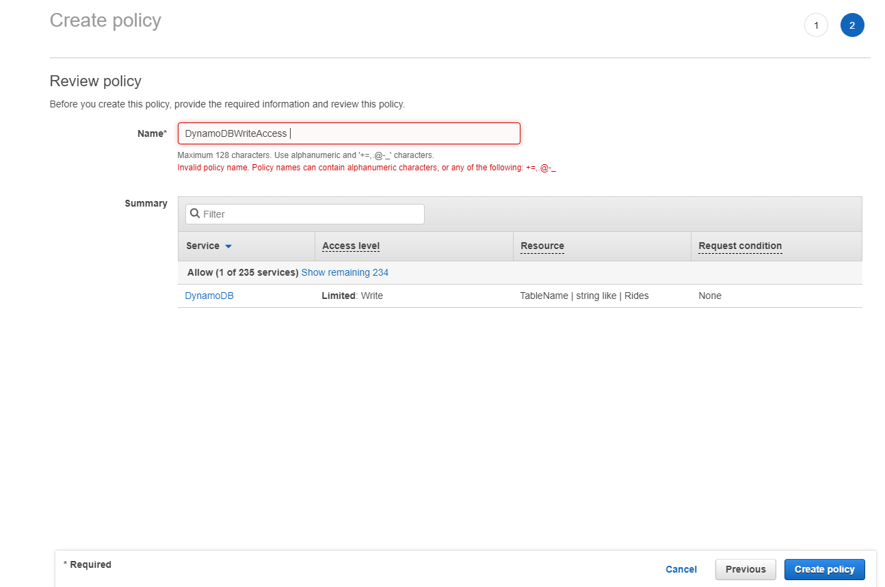

_Figure 3(J)_

Step 3: Create a Lambda Function for Handling Requests

1. Choose **Services** then select **Lambda** in the Compute section.
2. Click **Create function**.

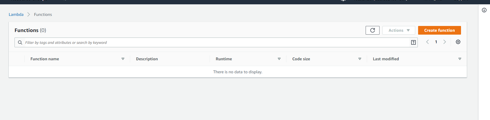

_Figure 3(K)_

1. Keep the default **Author from scratch card** selected.
2. Enter RequestUnicorn in the **Name** field.
3. Select **Node.js 6.10** for the **Runtime.**
4. Ensure Choose an existing role is selected from the **Role** dropdown.
5. Select WildRydesLambda from the **Existing Role** dropdown.
6. Click on **Create function**.

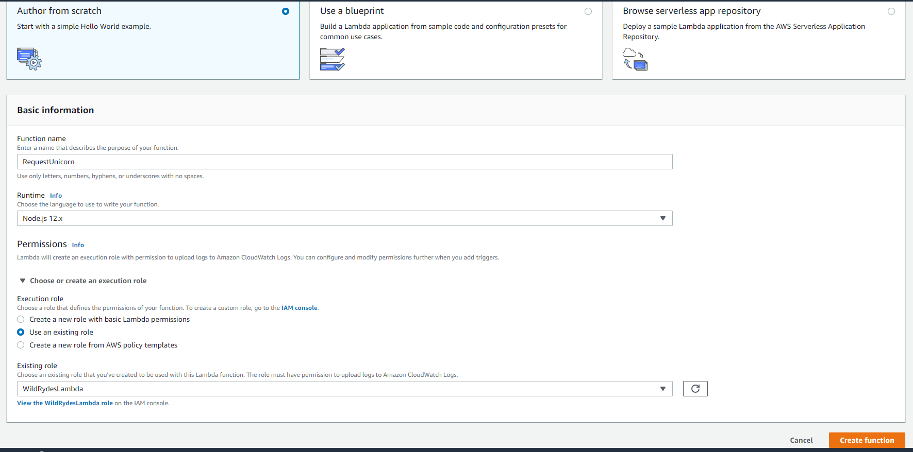

_Figure 3(L)_

1. Scroll down to the **Function code** section and replace the existing code in the **index.js** code editor with the contents of [requestUnicorn.js](https://github.com/aws-samples/aws-serverless-workshops/blob/master/WebApplication/3_ServerlessBackend/requestUnicorn.js).

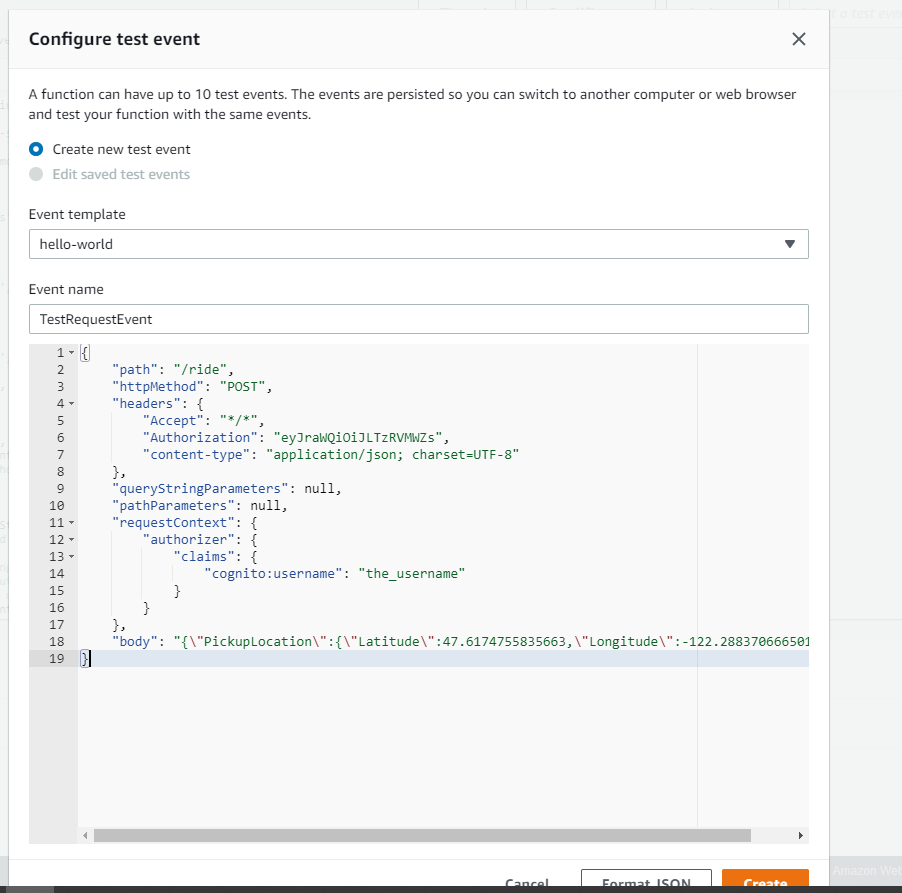

_Figure 3(M)_

1. Click **&quot;Save&quot;** in the upper right corner of the page.

Step 4: Test your Implementation

1. From the main edit screen for your function, select **Configure test event** from the **Select a test event...** dropdown.
2. Keep **Create new test event** selected.
3. Enter TestRequestEvent in the **Event name** field
4. Copy and paste the following test event into the editor:

{ &quot;path&quot;: &quot;/ride&quot;,

&quot;httpMethod&quot;: &quot;POST&quot;,

&quot;headers&quot;: {

&quot;Accept&quot;: &quot;\*/\*&quot;,

&quot;Authorization&quot;: &quot;eyJraWQiOiJLTzRVMWZs&quot;,

&quot;content-type&quot;: &quot;application/json; charset=UTF-8&quot;

},

&quot;queryStringParameters&quot;: null,

&quot;pathParameters&quot;: null,

&quot;requestContext&quot;: {

&quot;authorizer&quot;: {

&quot;claims&quot;: {

&quot;cognito:username&quot;: &quot;the\_username&quot;

}

} }, &quot;body&quot;: &quot;{\&quot;PickupLocation\&quot;: {\&quot;Latitude\&quot;:47.6174755835663,\&quot;Longitude\&quot;:-122.28837066650185}}&quot;}

1. Click **Create**.

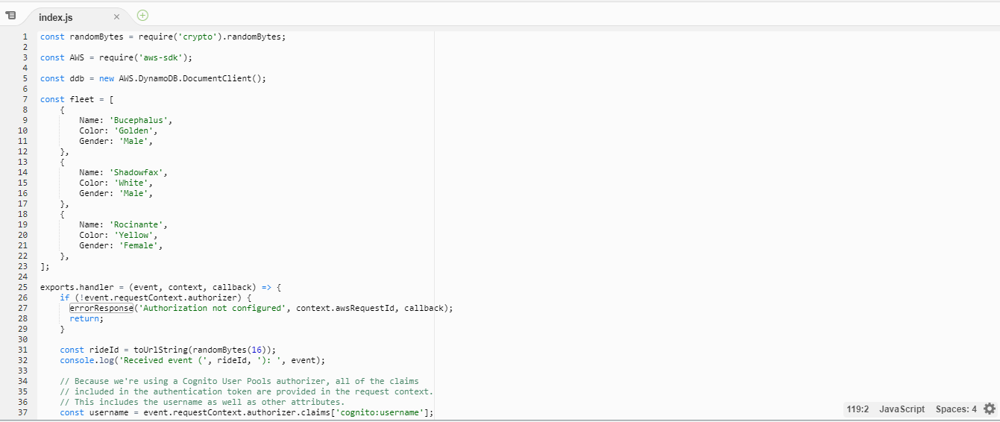

_Figure 3(N)_

1. On the main function edit screen click **Test** with TestRequestEvent selected in the dropdown.
2. Scroll to the top of the page and expand the **Details** section of the **Execution**** result** section.
3. Verify that the execution succeeded and that the function result looks like the following:

{

&quot;statusCode&quot;: 201,

&quot;body&quot;: &quot;{\&quot;RideId\&quot;:\&quot;SvLnijIAtg6inAFUBRT+Fg==\&quot;,\&quot;Unicorn\&quot;:{\&quot;Name\&quot;:\&quot;Rocinante\&quot;,\&quot;Color\&quot;:\&quot;Yellow\&quot;,\&quot;Gender\&quot;:\&quot;Female\&quot;},\&quot;Eta\&quot;:\&quot;30 seconds\&quot;}&quot;,

&quot;headers&quot;: {

&quot;Access-Control-Allow-Origin&quot;: &quot;\*&quot;

}

}

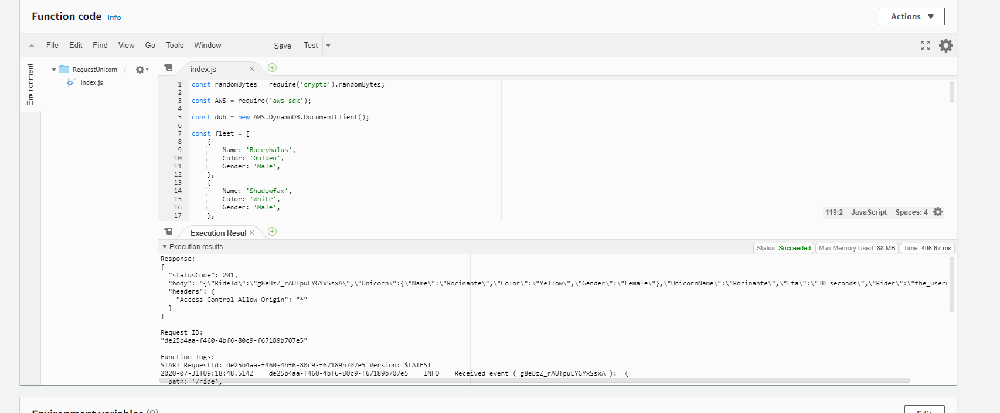

_Figure 3(O)_

# Section 5: RESTful APIs

Step 1: Create a new REST API

1. In the AWS Management Console, click **Services** then select **API Gateway** under Application Services.
2. Choose **Create API.**
3. Select **New API** and enter 1922491-BenjaminCheong for the **API Name.**
4. Keep Edge optimized selected in the **Endpoint Type** dropdown.
5. Choose **Create API**

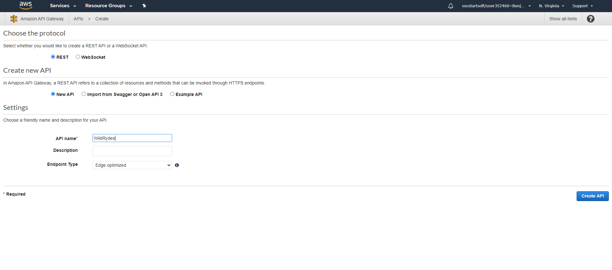

_Figure 4(A)_

Step 2: Create a Cognito User Pools Authorizer

1. Under your newly created API, choose **Authorizers.**
2. Chose **Create New Authorizer**.
3. Enter 1922491-BenjaminCheong for the Authorizer name.
4. Select **Cognito** for the type.
5. In the Region drop-down under **Cognito User Pool** , select the Region where you created your Cognito user pool in module 2 (by default the current region should be selected).
6. Enter 1922491-BenjaminCheong (or the name you gave your user pool) in the **Cognito User Pool** input.
7. Enter Authorization for the **Token Source**.
8. Choose **Create**.

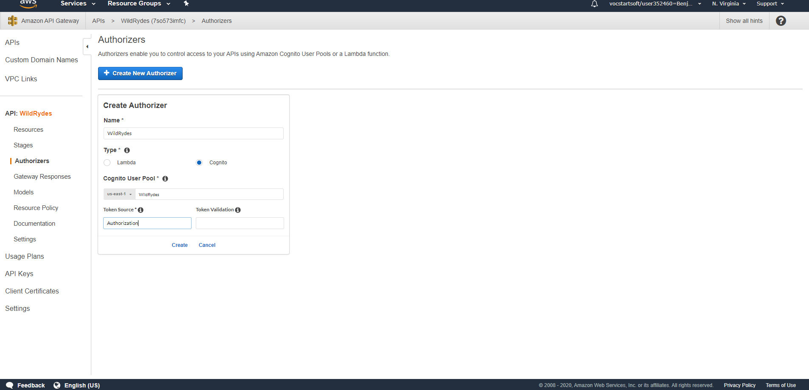

_Figure 4(B)_

**Verify your authorizer configuration**

1. Open a new browser tab and visit /ride.html under your website&#39;s domain.
2. If you are redirected to the sign-in page, sign in with the user you created in the last module. You will be redirected back to /ride.html.
3. Copy the auth token from the notification on the /ride.html,
4. Go back to previous tab where you have just finished creating the Authorizer
5. Click **Test** at the bottom of the card for the authorizer.
6. Paste the auth token into the **Authorization Token** field in the popup dialog.
7. Click **Test** button and verify that the response code is 200 and that you see the claims for your user displayed.

Step 3: Create a new resource and method

1. In the left nav, click on **Resources** under your _1922491-BenjaminCheong_ API.
2. From the **Actions** dropdown select **Create Resource.**

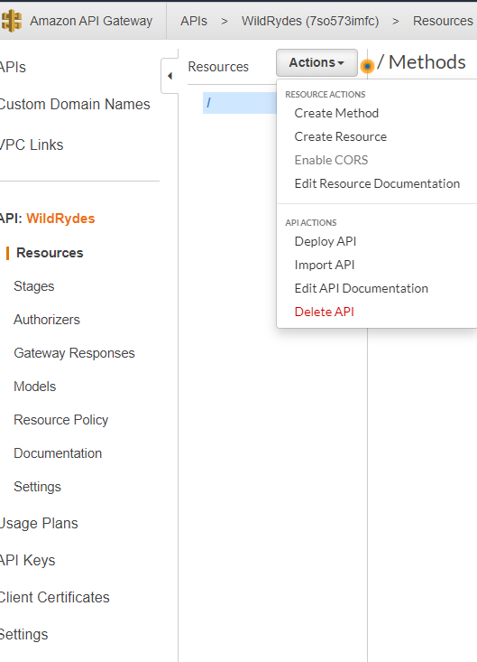

_Figure 4(C)_

1. Enter ride as the **Resource Name.**
2. Ensure the **Resource Path** is set to ride.
3. Select **Enable API Gateway CORS** for the resource.
4. Click **Create Resource.**

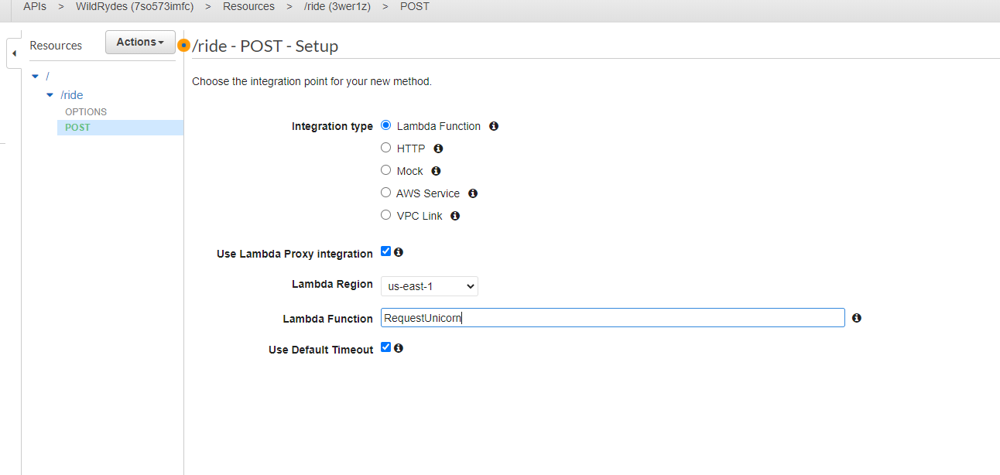

_Figure 4(D)_

1. With the newly created /ride resource selected, from the **Action** dropdown select **Create Method.**
2. Select POST from the new dropdown that appears, then **click the checkmark.**

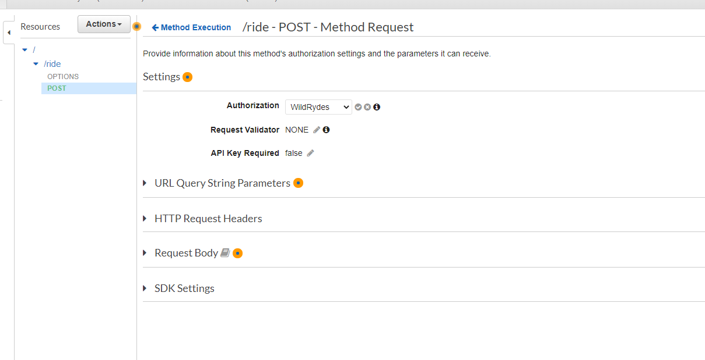

_Figure 4(E)_

1. Select **Lambda Function** for the integration type.
2. Check the box for **Use Lambda Proxy integration.**
3. Select the Region you are using for **Lambda Region.**
4. Enter the name of the function you created in the previous module, RequestUnicorn, for **Lambda Function.**
5. Choose **Save.** Please note, if you get an error that you function does not exist, check that the region you selected matches the one you used in the previous module.
6. When prompted to give Amazon API Gateway permission to invoke your function, choose **OK.**
7. Choose on the **Method Request card.**
8. Choose the pencil icon next to **Authorization.**
9. Select the WildRydes Cognito user pool authorizer from the drop-down list, and click the checkmark icon.

Step 4: Deploy Your API

1. In the **Actions** drop-down list select **Deploy API.**
2. Select **[New Stage]** in the **Deployment stage** drop-down list.
3. Enter prod for the **Stage Name.**
4. Choose **Deploy.**

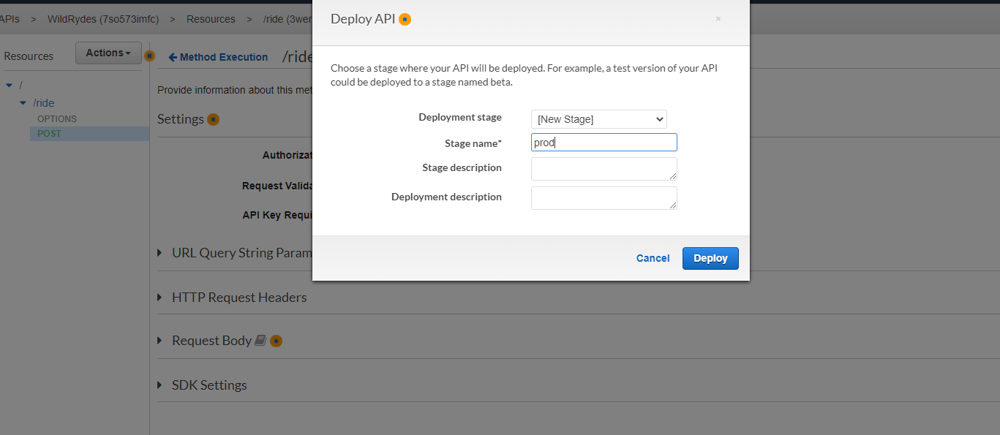

_Figure 4(F)_

1. Note the **Invoke URL.** You will use it in the next section.

Step 5: Update the Website Config

1. Open the config.js file in a text editor.
2. Update the **invokeUrl** setting under the **api** key in the config.js file. Set the value to the **Invoke URL** for the deployment stage your created in the previous section.

_Figure 4(G)_

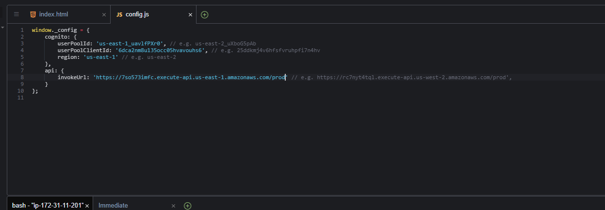

_Figure 4(H)_

1. Save the modified file and push it to your Git repository to have it automatically deploy to Amplify Console.

$ git push

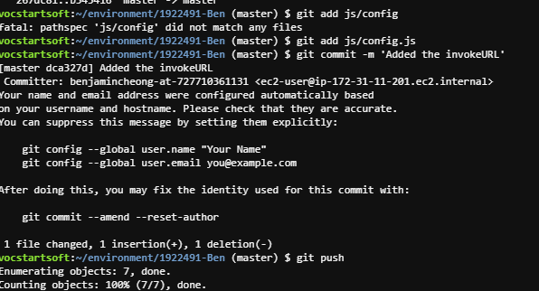

_Figure 4(I)_

Step 5: Validate your implementation

1. Visit /ride.html under your website domain.
2. If you are redirected to the sign in page, sign in with the user you created in the previous module.
3. After the map has loaded, click anywhere on the map to set a pickup location.
4. Choose **Request Unicorn**. You should see a notification in the right sidebar that a unicorn is on its way and then see a unicorn icon fly to your pickup location.

Additional Comments:

You have come to the end of the Project, and I hope you are able to build the project like I did. If you have any issues, refer to stack overflow for more information

_Individual Assignment done by_: _BENJAMIN CHEONG CHEE WENG
