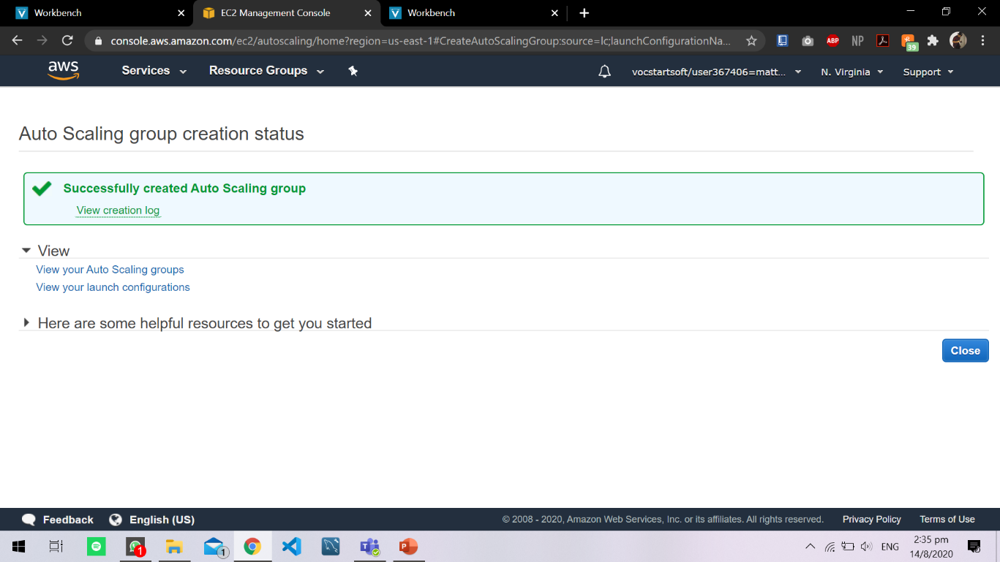
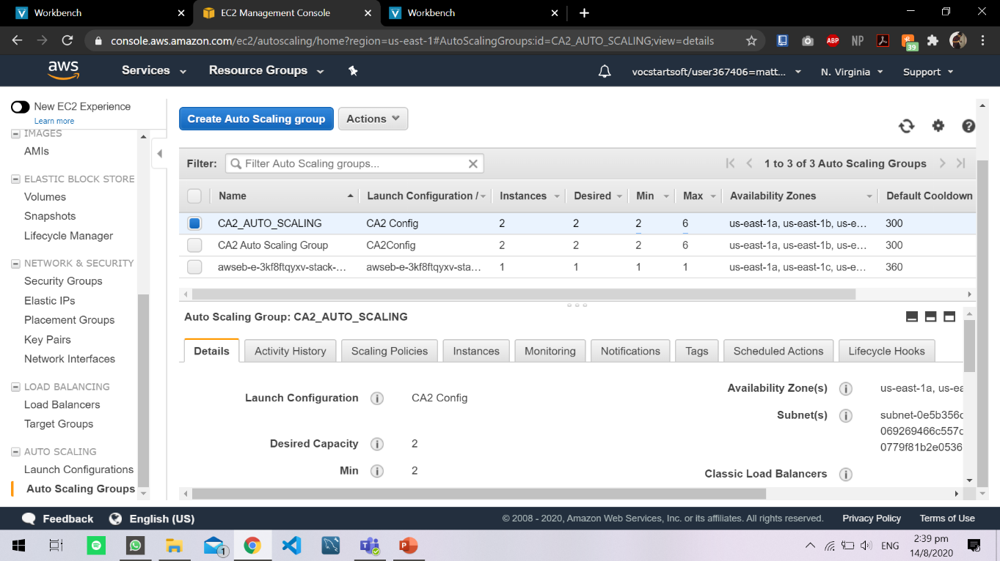

## EP0404 AWS Cloud Foundation Lab 3 Assessment

## Group Component (20%)

Topic: Option B

By: _Benjamin Cheong Chee Weng (1922491),_

_Matthew Andrews De Guzman Echano (1946358)_

_YouTube Demo Link: https://youtu.be/vw5KBSaJDuc_

# Problem Statement

The _three-tier architecture_ with web and application tier server and a MySQL Database used by our start-up company should help workers streamline the process of registering specifically e-commerce goods into the database using a QR code that shows the relevant information of the worker and the product automatically into the database.

# Architecture Design

# Explanation of our solution

This architecture solution is a Multi-Availability zone deployment with an Amazon EC2 Web Instance in an _Auto Scaling Group_, _Amazon RDS, Amazon RDS__Read Replica, Elastic Load Balancer_.

Multi-Availability Zone allows the architecture to be fault-tolerant and high availability. It reduces downtime for required for version upgrades and reduces the impact of backup snapshots and creation of replicas.

The **Elastic Load Balancer** distributes incoming application or network traffic across multiple targets in a single Availability Zone or across multiple Availability Zones which ensures _high availability_ and _fault tolerant_ applications and with _elasticity_ and _scalability_ and allows for dynamic and predictive scaling for EC2 Web Instances by using _AWS CloudWatch._ The EC2 instance can scale dynamically based on the demand for the given month, this will lower the cost of running the EC2 Web Instance. Therefore, it helps _optimize_ the cost of the architecture.

Amazon **Relational Database** provides _high availability_, _storage scalability_, _minimizes potential data loss_, _fault tolerant_. Amazon RDS provides synchronous replication for potential data loss. When the Amazon RDS fails, it will automatically bring the standby instance online as the new _main instance_. Amazon RDS protects your database instance if there is ever a _disruption within the availability zone_.

Therefore, this architecture is _high availability, high reliability_, _fault-tolerant_, _scalable_, _efficient_, and _resilient_ solution for the problem statement that we have defined.

## Compare and contrast alternative AWS solutions

  - Option A:

Option A architecture solution does offer the similar features in having Auto scaling group behind an ELB &amp; Amazon RDS instance deployed with read replicas in the other AZ. The difference in option A is that they have two AZs with three Amazon EC2 instances. They key difference it that having one lesser AZ would mean that they will have lesser availability. The consequence of that would be limiting the flow of traffic which can affect network congestion. They do have one more EC2 instance which allows them to have more control over the guest systems in the servers &amp; have more control of the traffic coming in and out of the instances. This improves the security level in both their application tier and web tier.

  - Option C:

For option C architecture solution, the key difference is that it runs a Multi-AZ Amazon RDS deployment as compared to option B&#39;s one Amazon RDS instance with read replicas in the other two AZ&#39;s. Multi-AZ Amazon RDS deployment has a Master database in one AZ and a Standby database in another AZ. It is a synchronous replica but cannot be accessed. Once the master database fails, the standby database will take over and starts to handle the traffic. This increases its reliability and reduce the downtime required for version upgrades and reduces the impact of backup snapshots and creation of replicas, since snapshots can be done from the spare (by the service). However, it doubles the cost of the instance because of it having a standby database.

## Strengths and Challenges of proposed solution

- Strengths
  - High Availability
  - High Fault-tolerance
  - High Resilient
  - Efficient
  - Cost Optimized
  - Dynamic Scalability
  - Resilient
  - Security Group for the Private Subnets

- Challenges

  - Slightly longer downtime due to RDS deployment with read replica
  - Unable to have massive read/write rates (150,000 write/second)
  - Greater Cost

# Documentation of Architecture

Content

1. Security Groups
     1. _Creating a VPC Security Group_
     2. _Creating an RDS Security Group_
     3. _Creating a Web Service Security Group_
2. VPC
     1. _Creating a Virtual Private Cloud_
     2. _Creating Public Subnet in each Availability Zone_
     3. _Creating Private Subnet in each Availability Zone_
     4. _Creating an Internet Gateway_
     5. _Creating an Elastic IP Address_
3. Load Balancer and Auto Scaling
     1. _Creating a Load Balancer with Target Group_
     2. _Creating Launch Configuration_
     3.  _Creating Auto Scaling Group_
4. Relational Database
     1.  _Creating Main RDS in Private Subnet 1_
     2.  _Creating Multi-AZ RDS Read Replica_
5. Issues Faced and Our Solution

# Security Groups

1. Creating a VPC Security Group
  1. Click Services and Click &#39;VPC&#39;

  1. Click Security group on the left panel

  1. Click &quot;Create Security Group&quot;

  1. Type &quot;CA2 VPC&quot; in the Security group name
  2. Type &quot;VPC Security Group&quot; in the Description
  3. Choose &quot;#yourchosenVPC&quot; in the VPC

  1. Copy the Inbound and Outbound Rule as the picture below

1. Creating an RDS Security Group
  1. Click &quot;Instance&quot; and on the left panel click &quot;Security Group&quot;

  1. Click &quot;Create a Security Group&quot;
  2. Type &quot;CA2 RDS&quot; in the Security group name
  3. Type &quot;RDS Security Group&quot; in the Description
  4. Type &quot;#yourVPC&quot; in VPC

  1. Copy the Inbound and Outbound Rule as the picture below

1. Creating a Web Service Security Group

  1. Click services and click &#39;EC2&#39;

  1. Click on the EC2 Management Console &quot;Security Group&quot;

  1. Click &quot;Create Security Group&quot;

  1. Type &quot;CA2 Web Instance&quot; as the security group name.
  2. Type &quot;Web Instance Security Group&quot; as the Description.
  3. Choose &quot;#yourchosenVPC&quot; as the VPC.
  4. Under the Inbound Rule, add the rules like the picture below.

# Virtual Private Cloud

1. Creating a Virtual Private Cloud
  1. Select VPC in Services tab
  2. Click on launch VPC wizard
  3. Select the Second option &quot;VPC with Public and Private Subnets&quot;
  4. Copy the configuration like the picture below

  1. If it is created successfully, you should see this output like the picture

1. Creating Public Subnet in each Availability Zone
  1. Click Services and go to &quot;VPC&quot;
  2. On the left dashboard, click on &quot;Subnets&quot;
  3. On the top left of the Subnet Dashboard, click create Dashboard
  4. For the first Public Subnet, type &quot;Public Subnet 1&quot; in the Name tag
  5. Click the VPC that was created before this
  6. Choose &quot;us-east-1a&quot; as the Availability Zone
  7. In the IPv4 CIDR block, type &quot;10.0.4.0/24&quot;
  8. Click Create at the bottom right

  1. To create the 2nd Public Subnet, click Create subnet on the Subnet dashboard
  2. In the Name tag, Type in &quot;Public Subnet 2&quot;
  3. And in the Availability Zone, select &quot;us-east-1b&quot;
  4. The rest of the configuration is the same as &quot;Public Subnet 1&quot;
  5. Click Create at the bottom right
  6. To create the 3rd Public Subnet, Click Create Subnet on the Subnet dashboard
  7. In the Name Tag, Type in &quot;Public Subnet 3&quot;
  8. And in the Availability Zone, Select &quot;us-east-1c&quot;
  9. The rest of the configuration is the same as &quot;Public Subnet 1&quot;
  10. Click Create at the bottom right

1. Creating Private Subnet in each Availability Zone
  1. In the Subnet Dashboard, Click Create Subnet
  2. In the Name tag, type &quot;Private Subnet 1&quot;
  3. In the VPC, Select the VPC that was created before this section
  4. In the availability Zone, select the same Availability Zone as &quot;Public Subnet 1&quot;
  5. In the IPv4 CIDR block, type &quot;10.0.5.0/24&quot;
  6. Click Create
  7. Do Step 3a – 3f for Public Subnet 2 and 3, while changing the Name Tag to the appropriate name and change the Availability Zone to the same as the Public Subnet number
  8. Ensure that it is similar picture.

1. Creating an Internet Gateway
  1. Under Services, go to VPC
  2. On the left panel, click &quot;Internet Gateway&quot;
  3. Click &quot;Create Internet gateway&quot;

  1. Type &quot;CA2-Internet-Gateway&quot; as the Name
  2. Select the VPC that was created before
  3. Select &quot;Public Subnet 1&quot;
  4. Click Create
1. Creating a NAT Gateway
  1. Under Services, go to VPC
  2. On the left panel, click &quot;NAT Gateway&quot;
  3. On the top right of the NAT Gateway Dashboard, click &quot;Create NAT Gateway&quot;
  4. Type &quot; CA2-NAT-Gateway&quot; as the name
  5. Select the VPC that was created before this
  6. Click Create

# Load Balancer and Auto Scaling

  1. Creating a Load Balancer with Target Group
    1. Click on Load Balancer on the left panel
    2. Click Create Load Balancer on the top right of the window
    3. Name the Load Balancer &quot;CA2ELB&quot; with the scheme as internal

    1. Select the VPC Created
    2. Select the 3 different Private Subnets for the 3 Availability Zone

    1. Configure Security Groups and select the Default VPC

    1. Configure Routing like the picture below

    1. Make sure your review Load Balancer

  1. Creating Launch Configuration
  2. Creating Auto Scaling Group
    1. Name the Group Name &quot;CA2\_Auto\_Scaling&quot;
    2. Group size 1
    3. Select the VPC that is used
    4. Select the 3 different Private Subnet

  1. Copy the configuration for the Scaling policies

  1. Configure Tags and Key &quot;Name&quot; and Value &quot;CA2\_Auto\_Scaling\_Group&quot;

  1. Make sure the Review Auto Scaling Group

  1. Once created, go back to the Auto Scaling Group Dashboard
  2. Right-Click the newly created Auto Scaling Group and click Edit

  1. Change the desired Capacity to &quot;6&quot;
  2. Change the min to &quot;2&quot;
  3. Change the max to &quot;6&quot;

# Relational Database

1. Creating Relational Database
  1. Go to services and Select RDS

  1. Select Create Database

  1. Select &quot;Standard Create&quot; &amp; &quot;MySQL&quot;

  1. Select &quot;Free Tier&quot; name DB Instance as CA2-Database put Master Credientials

  1. Under Connectivity, Select the VPC that was created before this

  1. Click Create Database

1. Creating Relational Database Read Replica
  1. Click on the &quot;ca2-database&quot; and click actions on the top right of the website

  1. Click &quot;Create Read Replica&quot;

  1. Select the DB instance class as &quot;db.t2.micro – 1 vCPU&quot;
  2. Select Multi-AZ deployment as &quot;no&quot;
  3. Name the DB instance identifier as &quot;ca2-database-read-replica&quot;

  1. Copy the Monitoring, Log exports

  1. Make sure it is created like the picture below.

_End of documentation_

# Issues Faced and Our Solution

  1. Auto Scaling &quot;Min/Max Instance&quot;

The issue we faced with the creation of the auto scaling group was with the section called &quot;Configure scaling policies&quot;.

We first configure the scaling policies by putting &quot;Scale between _2_ and _6_ instances&quot;. Along with adding the target value &quot;60&quot;.

However, after doing so we faced an error once we start creating the auto-scaling group:

So, for us to still have the right scaling policies applied. We first configured the scaling policy to &quot;Scale between _1_ and _2_ instances. &quot;

Which in return makes the creation of the auto scaling group succeeded. Here&#39;s the result:

After the creation of the auto scaling group, we navigate back and went to edit the auto scaling group that was created:

We then proceed to change the value of the _Min and Max Instances, where_ min value would be 2 and the max value would be 6 as what it was intended to be:

Once we click saved it successfully change the value and it was able to run the policy

1. Issued face was we can deploy a Multi-AZ Deployment for RDS, we wanted 1 master RDS and 2 other Read Replica so that we can scale our database based on the depends. This provides Scalability.
  1. Using AWS educate account, we are not authorized to perform a Multi-AZ Deployment

 

  1. What we did is to create a normal database without Multi-AZ Deployment, and we created read replicas as attached it to the different subnets with the same RDS Security Group
    1. Click Create Read Replica

    1. Configure the settings of the read replica as below

This will allow us to have a Maid RDS and 1 Read Replica in each Availability Zone

_Done 13/8/2020_

